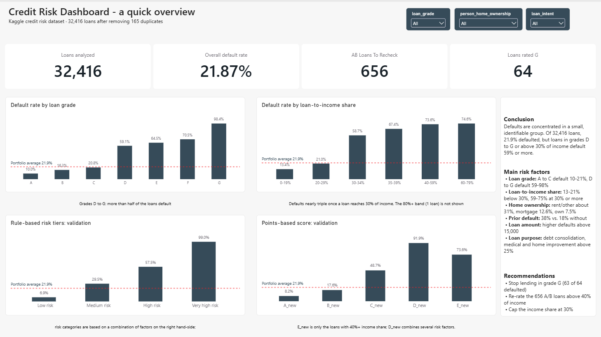

# Credit Risk Analysis: What Drives Loan Defaults?

An end-to-end SQL analysis of 32,581 loans: cleaning the data, finding the factors that drive defaults, identifying mis-rated loans, and proposing two alternative ways to rate risk.

**Tools:** MySQL (CTEs, window functions, `ROLLUP`, views) · Power BI (dashboard)
**Data:** [Credit Risk Dataset on Kaggle](https://www.kaggle.com/datasets/laotse/credit-risk-dataset)

## Highlights

- **21.87%** of the 32,416 loans (after removing 165 duplicates) defaulted.
- Default rates climb from **9.96%** for grade A to **98.44%** for grade G; grades D to G all exceed 59%.
- Once a loan takes up **30% or more of income**, the default rate jumps from 21% to 59% or higher.
- A transparent rule-based rating separates **6.93%** (low risk) from **99.03%** (very high risk), and the default rate rises at every step.

---

## Business questions

1. Which borrower and loan characteristics are linked to loan defaults?
2. Are the existing loan grades (A-G) trustworthy, or are risky loans rated too well?
3. Can we build a simple, transparent risk rating that separates safe from risky loans better?

## Dataset

One row per loan, 12 columns:

| Group | Columns |
|---|---|
| Borrower | `person_age`, `person_income`, `person_home_ownership`, `person_emp_length` |
| Loan | `loan_intent`, `loan_grade`, `loan_amnt` (renamed `loan_amount`), `loan_int_rate`, `loan_percent_income` |
| Credit history | `cb_person_default_on_file`, `cb_person_cred_hist_length` |
| Target | `loan_status` (1 = default, 0 = no default) |

The data has no primary key, no dates and no loan term, so no time-based analysis was possible.

## Approach

1. **Setup:** created the database and raw table (with a primary key), loaded the CSV, and copied it to `credit_risk2` so the raw data stays untouched.
2. **Exploration and cleaning:** checked NULLs, outliers and implausible values, then removed duplicates.
3. **Analysis:** calculated default rates by loan grade, loan amount, loan-to-income share, home ownership, prior default and loan purpose. Each overview is saved as a view.
4. **Mis-rated loans:** compared the existing grades with the risk signals found in step 3.
5. **Risk models:** built a rule-based risk category and a points-based risk score, and validated both against actual defaults.

## Data quality findings

| Issue | Count | Action |
|---|---|---|
| Duplicate rows | 165 | Found with `ROW_NUMBER()` over all columns, deleted (32,581 → 32,416 rows) |
| Missing `loan_int_rate` | 3,095 (~10%) | Default rate similar to the rest, so ignored in this analysis; imputation needed later |
| Missing `person_emp_length` | 887 | Open: needs imputation |
| Age above 100 (maximum 144) | 5 | Set to NULL |
| Employment length above 100 years | 2 | Set to NULL |
| Started working at age 15-18 | 9,228 | Flagged for validation |
| Income above 1,000,000 (maximum 6,000,000) | 9 | Flagged for validation |
| Text columns (`loan_intent`, `person_home_ownership`) | n/a | Checked for typos and stray spaces: clean |

The NULL counts were measured before duplicates were removed.

## Key findings

### Default rate by loan grade (`loans_by_loan_grades`)

| Grade | Loans | Defaults | Default rate |
|---|---|---|---|
| A | 10,703 | 1,066 | 9.96% |
| B | 10,387 | 1,695 | 16.32% |
| C | 6,438 | 1,336 | 20.75% |
| D | 3,620 | 2,138 | 59.06% |
| E | 963 | 621 | 64.49% |
| F | 241 | 170 | 70.54% |
| G | 64 | 63 | 98.44% |
| **Total** | **32,416** | **7,089** | **21.87%** |

Grades A to C are at or below the portfolio average. From D upward, most loans default, so grades D to G are high-risk, and G is almost a certain default.

### Default rate by loan-to-income share (`loan_percent_groups`)

| Loan as share of income | Loans | Default rate |
|---|---|---|
| 0-19% | 21,363 | 13.43% |
| 20-29% | 6,786 | 20.97% |
| 30-34% | 1,848 | 58.71% |
| 35-39% | 1,086 | 67.40% |
| 40-59% | 1,273 | 73.61% |
| 60-79% | 59 | 74.58% |
| 80% and above | 1 | n/a (single loan) |

The default rate nearly triples between the 20-29% band and the 30-34% band, so **30%** is the clear risk threshold.

### Default rate by home ownership (`loans_by_person_home_ownership`)

| Home ownership | Loans | Default rate |
|---|---|---|
| Rent | 16,378 | 31.61% |
| Other | 106 | 31.13% |
| Mortgage | 13,369 | 12.62% |
| Own | 2,563 | 7.49% |

Renters default about **2.5 times** as often as mortgage holders.

### Other drivers

- **Prior defaults:** borrowers with a default on file default again **38%** of the time vs. **18%** without (`loans_by_prior_defaults`).
- **Loan size:** default rates are higher from a loan amount of **15,000** (`loan_amount_groups`).
- **Loan purpose:** debt consolidation, medical and home improvement loans each exceed **25%** defaults.

### Mis-rated loans

| Count | Finding |
|---|---|
| 656 | Rated A or B, but the loan is above 40% of income |
| 9 | Loan above 70% of income: should be rated E or worse |
| 200 | Income share >30%, loan >15,000, renter/other and prior default, yet not rated G |
| 64 | Rated G today (the highest-risk class) |

## Risk models

### 1. Rule-based categories (`risk_categories_all`)

A `CASE` expression evaluated top-down; the first match wins.

| Tier | Rule (simplified) |
|---|---|
| Very high | Grade G, or grade E/F combined with income share >30%, renter/other, prior default and a loan >15,000 |
| High | Income share >30%; or loan >15,000 with renter/other or prior default; or grade E/F with renter/other or prior default |
| Low | Grade A/B with income share ≤30%; or homeowner (`OWN`) with income share ≤30%, **no** prior default and a loan <15,000 |
| Medium | Everything else |

### 2. Points-based score (`scored_all`)

| Factor | Points |
|---|---|
| Loan-to-income share: <10% / 10-19% / 20-29% / 30-39% / 40%+ | 0 / 1 / 2 / 4 / 9 |
| Home ownership: mortgage or own / rent or other | 0 / 2 |
| Prior default on file | +1 |
| Loan amount above 15,000 | +1 |

Score to new grade: 0-1 → `A_new`, 2-4 → `B_new`, 5-6 → `C_new`, 7-8 → `D_new`, 9+ → `E_new`.

### Validation against actual defaults

A good rating shows default rates that rise from the best tier to the worst.

**Rule-based categories** (`risk_categories_distribution`)

| Tier | Loans | Default rate |
|---|---|---|
| Low risk | 18,545 | 6.93% |
| Medium risk | 7,911 | 29.48% |
| High risk | 5,857 | 57.52% |
| Very high risk | 103 | 99.03% |

The rates rise at every step, and the model puts 57% of all loans in the low-risk tier with a default rate of only 6.93%.

**Points-based score** (`scored_distribution`)

| New grade | Loans | Default rate |
|---|---|---|
| A_new | 9,577 | 8.24% |
| B_new | 17,671 | 17.63% |
| C_new | 3,056 | 48.69% |
| D_new | 779 | 91.91% |
| E_new | 1,333 | 73.59% |

The score separates good from bad loans well at the low end, but **it is not monotonic**: `E_new` defaults less often (73.59%) than `D_new` (91.91%). The cause is the weighting. `E_new` consists exactly of the loans with an income share of 40% or more, because 9 points for that factor alone already reaches the top grade. `D_new` contains borrowers who combine several risk factors (30-39% income share, renting, prior default, large loan) and who default more often. The weights were chosen by hand from the exploratory analysis, so a data-driven approach (for example logistic regression) would be the next step.

## Recommendations

1. Stop lending in grade G (63 of 64 loans defaulted).
2. Treat grades D to F as high-risk: reduce loan sizes and tighten terms.
3. Re-rate the 656 A/B loans with an income share above 40%.
4. Limit loan size above 15,000 and cap the income share at 30%.
5. Apply extra scrutiny to renters and borrowers with a prior default.

## Dashboard (Power BI)

!

## Limitations

- The dataset has no dates or loan term, so there is no time analysis.
- Both risk models use rules and weights chosen from exploratory analysis, not a trained statistical model. They are evaluated on the same data they were designed on (no train/test split), so the validation results are optimistic.
- The points-based score is not monotonic (see validation above) and needs recalibration.
- ~10% of interest rates and 887 employment lengths are missing and were not imputed.
- Some outliers (ages, tenure, income) could not be verified without access to the data owner.
- The 80%+ income-share band contains a single loan, so its default rate is not meaningful.
